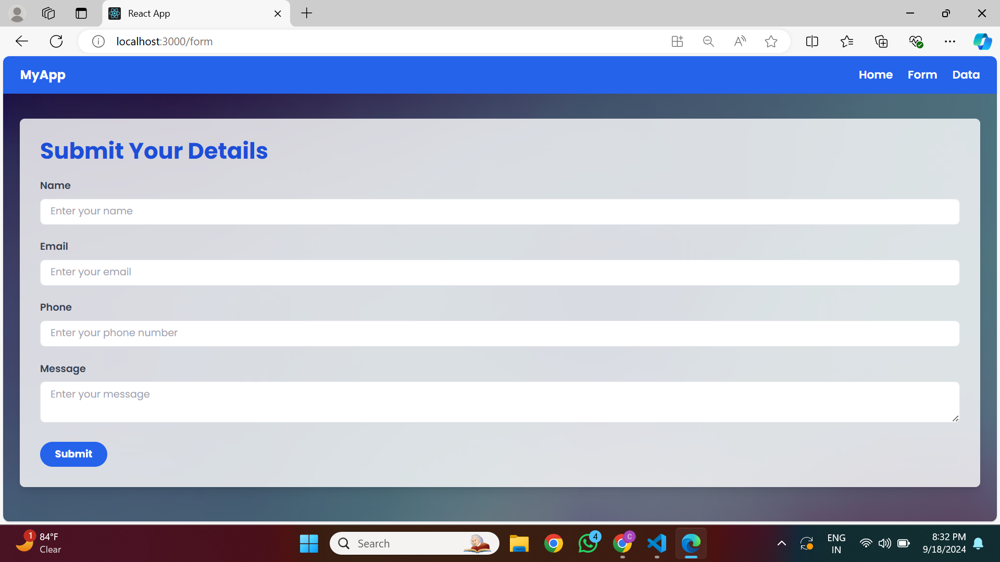
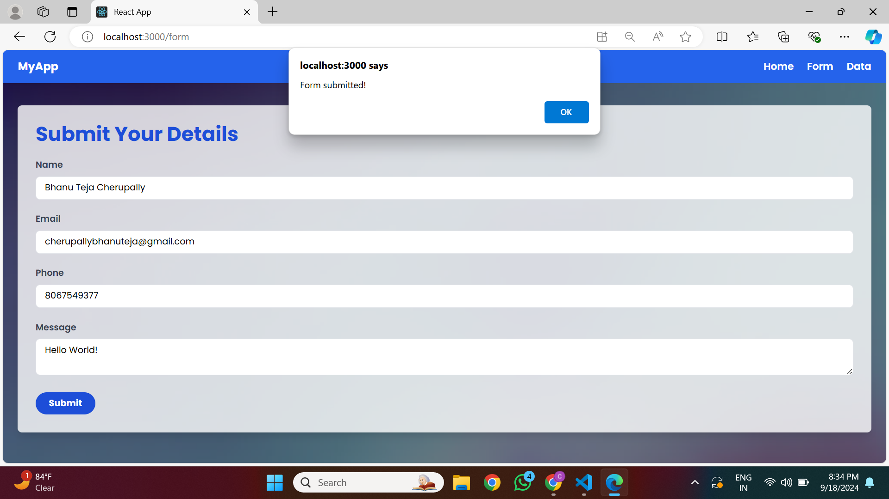
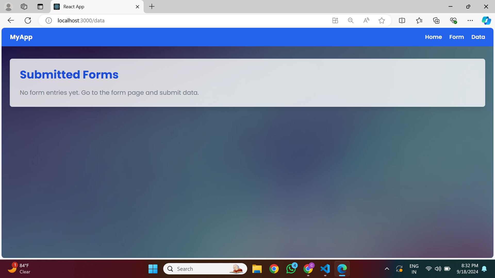
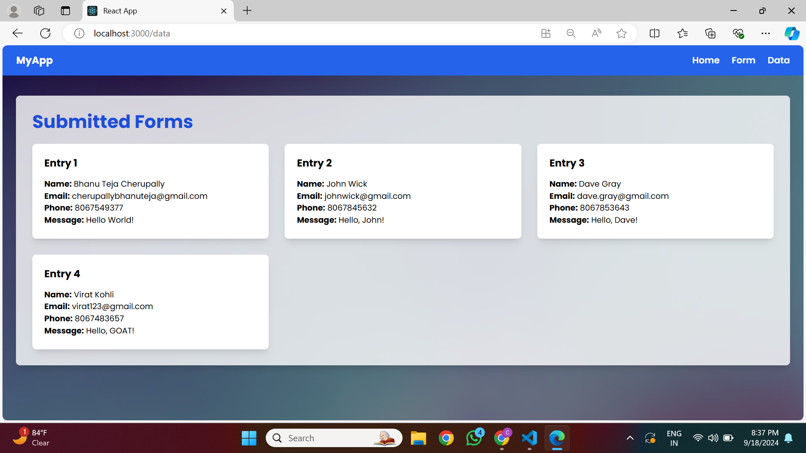

# React and Tailwind CSS Form Project

This project is a responsive form submission interface built with React.js and Tailwind CSS. It includes a simple, aesthetically pleasing UI with form input and data display pages. The project features a home page, a form submission page, and a data display page where all submitted form entries are listed.

## Features:
- **Home Page:** A welcoming landing page with a "Get Started" button.
- **Form Page:** Allows users to submit their details (name, email, phone, message).
- **Data Page:** Displays all the submitted forms with the details.

### Technologies Used:
- React.js
- Tailwind CSS
- React Router

## Screenshots:

### Home Page:


### Form Page (before submission):


### Form Page (after submission):


### Data Page (with no entries):


### Data Page (with submitted entries):


## How to Run the Project:
1. Clone the repository:
    ```bash
    git clone https://github.com/cherupallybhanuteja/react-tailwind-project.git
    ```
2. Install dependencies:
    ```bash
    npm install
    ```
3. Start the development server:
    ```bash
    npm start
    ```
4. The app will be available at `http://localhost:3000`.

## License:
This project is licensed under the MIT License.
